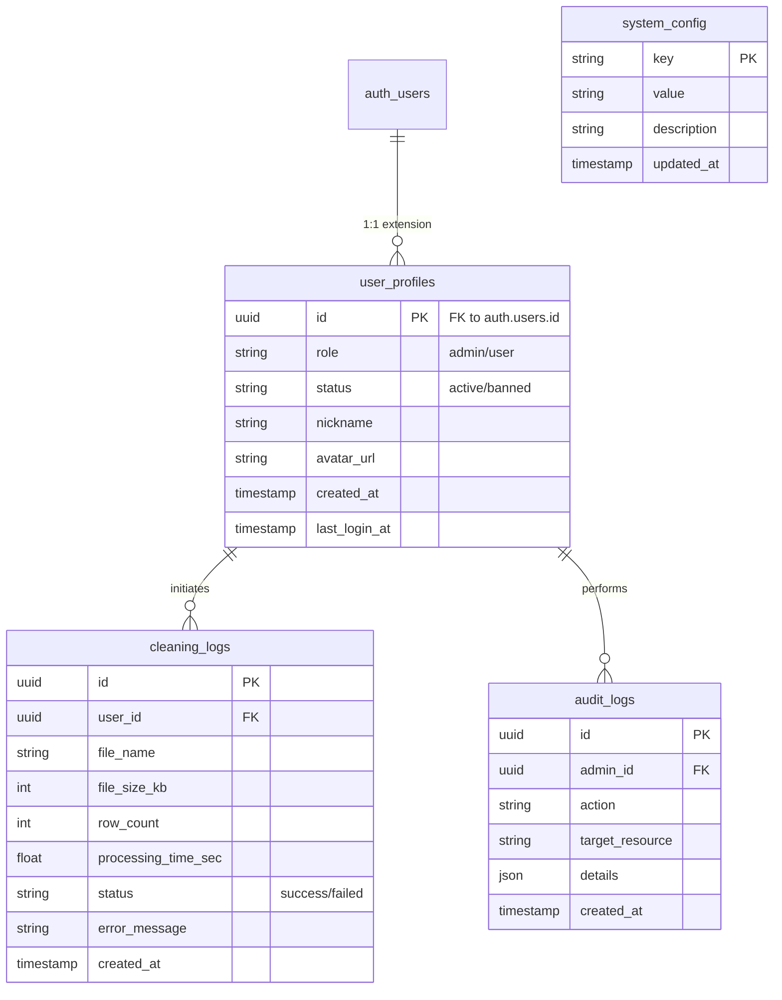

# 第二阶段：数据库设计

为了支持后台管理系统的功能，我们需要在 Supabase (PostgreSQL) 中扩展现有的数据结构。
虽然 Supabase Auth 处理了基本的登录凭证，但我们需要额外的表来存储用户画像、角色、日志和系统配置。

## 1. ER 图概念模型

## 2. 数据表详细定义

### 2.1 用户档案表 (`public.user_profiles`)
用于扩展 Supabase `auth.users` 表的信息。通过 Trigger 自动创建。

| 字段名 | 类型 | 约束 | 说明 |
| :--- | :--- | :--- | :--- |
| `id` | uuid | PK, FK(auth.users.id) | 与 Auth 表 ID 一致 |
| `role` | varchar(20) | Default 'user' | 角色：`user`, `admin`, `super_admin` |
| `status` | varchar(20) | Default 'active' | 状态：`active`, `banned` |
| `nickname` | varchar(50) | Nullable | 昵称 |
| `created_at` | timestamptz | Default now() | 创建时间 |
| `updated_at` | timestamptz | Default now() | 更新时间 |

### 2.2 清洗任务日志表 (`public.cleaning_logs`)
记录所有用户的清洗操作，用于统计和审计。

| 字段名 | 类型 | 约束 | 说明 |
| :--- | :--- | :--- | :--- |
| `id` | uuid | PK, Default gen_random_uuid() | 日志ID |
| `user_id` | uuid | FK(user_profiles.id) | 操作用户 |
| `file_name` | varchar(255) | Not Null | 原始文件名 |
| `file_size_bytes` | bigint | Not Null | 文件大小 |
| `row_count` | int | Nullable | 处理行数 |
| `processing_time_ms` | int | Nullable | 处理耗时(毫秒) |
| `status` | varchar(20) | Not Null | `success`, `failed` |
| `error_message` | text | Nullable | 错误信息 |
| `created_at` | timestamptz | Default now() | 记录时间 |

### 2.3 系统配置表 (`public.system_config`)
存储动态配置，避免硬编码。

| 字段名 | 类型 | 约束 | 说明 |
| :--- | :--- | :--- | :--- |
| `key` | varchar(50) | PK | 配置键 (e.g., `MAX_FILE_SIZE_MB`) |
| `value` | text | Not Null | 配置值 |
| `description` | varchar(255) | Nullable | 描述 |
| `updated_at` | timestamptz | Default now() | 最后修改时间 |

### 2.4 管理员审计日志 (`public.audit_logs`)
记录后台管理员的操作。

| 字段名 | 类型 | 约束 | 说明 |
| :--- | :--- | :--- | :--- |
| `id` | uuid | PK | 日志ID |
| `admin_id` | uuid | FK(user_profiles.id) | 操作管理员ID |
| `action` | varchar(50) | Not Null | 动作 (e.g., `BAN_USER`, `UPDATE_CONFIG`) |
| `target_resource` | varchar(50) | Nullable | 目标资源类型 (e.g., `user`, `config`) |
| `target_id` | varchar(50) | Nullable | 目标对象ID |
| `details` | jsonb | Nullable | 变更详情快照 |
| `ip_address` | varchar(45) | Nullable | 操作IP |
| `created_at` | timestamptz | Default now() | 操作时间 |

## 3. RLS (Row Level Security) 策略

为确保数据安全，必须在 Supabase 中启用 RLS：

1.  **`user_profiles`**:
    *   `SELECT`: 用户可看自己，管理员可看所有。
    *   `UPDATE`: 用户可改昵称，仅管理员可改 `role` 和 `status`。
2.  **`cleaning_logs`**:
    *   `INSERT`: 仅服务端 Service Role 可写（或用户仅可插入自己的）。
    *   `SELECT`: 用户可看自己的，管理员可看所有。
3.  **`system_config`**:
    *   `SELECT`: 公开可读（或仅认证用户）。
    *   `UPDATE`: 仅管理员。
4.  **`audit_logs`**:
    *   `SELECT`: 仅超级管理员。
    *   `INSERT`: 仅服务端逻辑写入。

## 4. 下一步行动
编写 SQL 迁移脚本，在 Supabase SQL Editor 中执行以创建上述表结构和策略。
